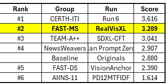
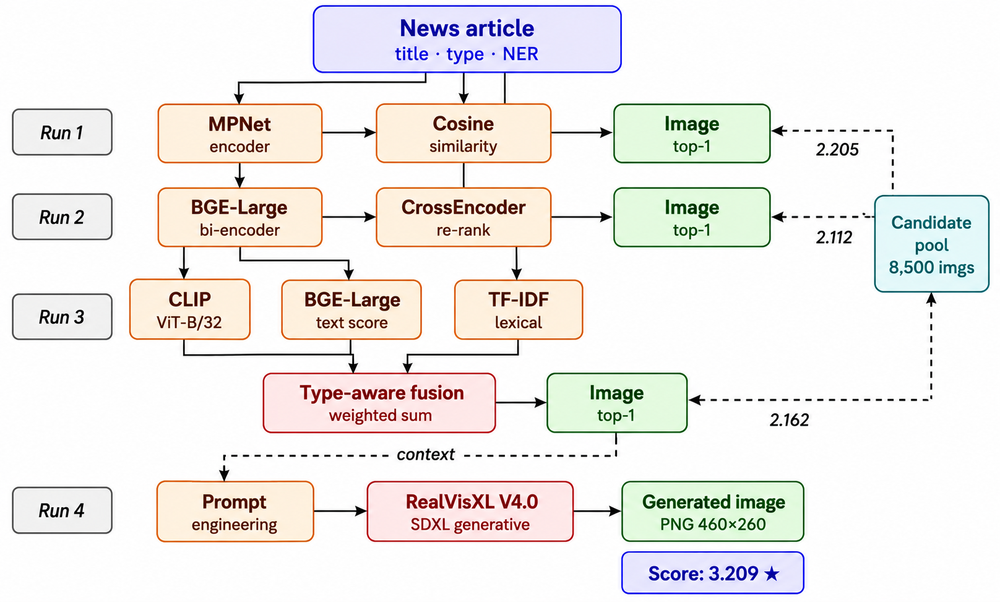

# 🥈 MediaEval 2026 NewsImages Challenge – 2nd Place Solution

[]()
[]()
[]()
[]()

Official repository for our **2nd Place** solution in the **MediaEval 2026 NewsImages Challenge**.

This repository accompanies our published system description paper and contains the complete implementation of our retrieval-based and generative approaches for recommending visually relevant images from news article titles.

---

# 🏆 Highlights

- 🥈 **2nd Place** in the MediaEval 2026 NewsImages Challenge
- 📄 **Official research paper published** in the MediaEval 2026 Working Notes Proceedings
- 🔍 Hybrid retrieval framework combining OpenCLIP, BGE embeddings, and TF-IDF
- 🎨 Retrieval and image generation using **RealVisXL**
- ⚡ Implemented using PyTorch, Hugging Face, Google Colab, and Kaggle

---

# 📄 Publication

### Hybrid Retrieval and Generative Image Recommendation for News Articles: The FAST-MS(DS) Approach at MediaEval 2026

**Authors**

- Aqsa Khan Jadoon
- Muhammad Rafi

<p align="center">
  
</p>

📄 **Paper**

https://2026.multimediaeval.com/paper22.pdf

---

# 🏅 Official Competition Results

Our proposed framework achieved **2nd Place** in the **MediaEval 2026 NewsImages Challenge**, demonstrating the effectiveness of combining semantic retrieval with diffusion-based image generation.

| Competition | Result |
|-------------|:------:|
| MediaEval 2026 NewsImages Challenge | 🥈 2nd Place |

<p align="center">
  
</p>

Official Leaderboard

https://github.com/Informfully/Challenges/blob/692eb1e46fc330f64a9ff29eea0fbdaff7e80c68/newsimages26/images/survey_results/_survey_results_26_ALL_TEAMS.xlsx

---

# 👥 Team Information

| Item | Details |
|------|---------|
| Team | FAST-MS |
| Institution | FAST National University of Computer and Emerging Sciences |
| Program | Master of Science in Data Science |
| Submission | May 2026 |

---

# 📖 Overview

The **MediaEval 2026 NewsImages Challenge** focuses on recommending or generating an image that best represents a news article title.

Our solution explores two complementary strategies:

- **Retrieval-Based Image Recommendation** – Selecting the most relevant image from the provided news image collection.
- **Text-to-Image Generation** – Synthesizing a new image directly from the news title using diffusion models.

The proposed hybrid framework leverages semantic understanding, lexical similarity, and modern generative AI to improve image recommendation quality.

---

# 🏗️ System Architecture

The proposed framework combines both retrieval-based and generative pipelines.

<p align="center">
  
</p>

The retrieval pipeline combines **OpenCLIP**, **BGE semantic embeddings**, and **TF-IDF lexical similarity** through weighted score fusion.

Alongside retrieval, a **RealVisXL** diffusion model generates images directly from article titles, enabling comparison between retrieval-based recommendations and generated visual content.

---

# ⚙️ Methodology

## 1️⃣ Retrieval-Based Image Recommendation

Three retrieval approaches were investigated.

### Official Retrieval Baseline

The organizer-provided retrieval baseline served as the reference system.

**Components**

- OpenCLIP Image-Text Embeddings
- Cosine Similarity

---

### Hybrid Retrieval (Best Retrieval Model)

Our primary retrieval model combines semantic and lexical similarity through weighted fusion.

**Components**

- OpenCLIP Embeddings
- BGE Semantic Embeddings
- TF-IDF Similarity

### Weighted Score Fusion

| Component | Weight |
|-----------|-------:|
| OpenCLIP | 30% |
| BGE Semantic Similarity | 50% |
| TF-IDF Similarity | 20% |

---

### Basic Retrieval

A semantic retrieval approach using dense text embeddings.

**Components**

- BAAI BGE Base EN v1.5
- Cosine Similarity

---

## 2️⃣ Text-to-Image Generation

### RealVisXL V5.0

Images were generated directly from article titles using the RealVisXL diffusion model.

### Generation Settings

| Parameter | Value |
|-----------|-------|
| Resolution | 512 × 512 |
| Inference Steps | 6 |
| Guidance Scale | 4.0 |
| CPU Offloading | Enabled |
| Memory Efficient Attention | Enabled |

---

# 📂 Dataset

| Dataset | Size |
|----------|-----:|
| Training Articles | 8,500 |
| Test Article Titles | 800 |

---

# 🚀 Submitted Runs

| Run | Method |
|------|--------|
| Run 1 | Official Retrieval Baseline |
| Run 2 | Hybrid Retrieval |
| Run 3 | Basic Retrieval |
| Run 4 | RealVisXL Generation |

---

# 📁 Repository Structure

```text
.
├── docs
│   ├── leaderboard.png
│   ├── paper_first_page.png
│   └── pipeline.png
│
├── NewsImages_officialRetrieval+Fluxgenerated.ipynb
├── NewsImages-Hybrid-Retrieval-entity-Realvisxl.ipynb
├── requirements.txt
├── LICENSE
└── README.md
```

---

# 🛠️ Technologies

| Category | Technology |
|----------|------------|
| Programming | Python |
| Deep Learning | PyTorch |
| NLP | Hugging Face Transformers |
| Diffusion Models | Hugging Face Diffusers |
| Vision-Language | OpenCLIP |
| Text Embeddings | BGE Base EN v1.5 |
| Lexical Retrieval | TF-IDF |
| Image Generation | RealVisXL |
| Development Environment | Google Colab, Kaggle |

---

# 💾 External Resources

The submitted run files and generated images are available on Google Drive.

https://drive.google.com/drive/folders/1GuLpKhCkggC8is65pjrXlatwgCXHxqDF?usp=drive_link

---

# 📌 Notes

- Embeddings were precomputed and cached to improve retrieval efficiency.
- Experiments were conducted using Google Colab and Kaggle.
- Memory-efficient inference settings enabled diffusion-based image generation on limited computational resources.
- This repository contains the implementation corresponding to our official MediaEval 2026 submission.

---

# 📚 Citation

If you use this repository in your research, please cite our paper.

```bibtex
@inproceedings{jadoon2026mediaeval,
  title={Hybrid Retrieval and Generative Image Recommendation for News Articles: The FAST-MS(DS) Approach at MediaEval 2026},
  author={Jadoon, Aqsa Khan and Rafi, Muhammad},
  booktitle={MediaEval 2026 Working Notes Proceedings},
  year={2026}
}
```

---

# 🙏 Acknowledgments

We sincerely thank the organizers of the **MediaEval 2026 NewsImages Challenge** for providing the benchmark dataset, evaluation framework, and the opportunity to contribute to this research challenge.

---

# 📬 Contact

**Aqsa Khan Jadoon**

- AI Engineer | Specialist Engineer – Digitalization
- FAST National University of Computer and Emerging Sciences
- GitHub: https://github.com/Aqsa-khan-Jadoon

---

⭐ **If you find this repository useful, consider giving it a star.**
